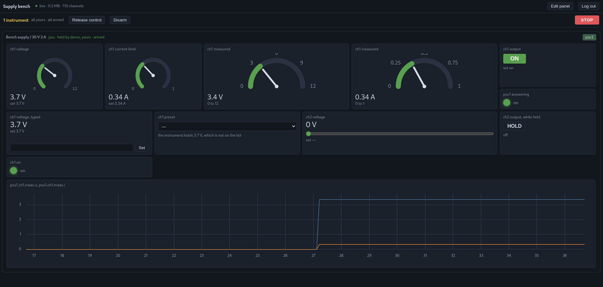
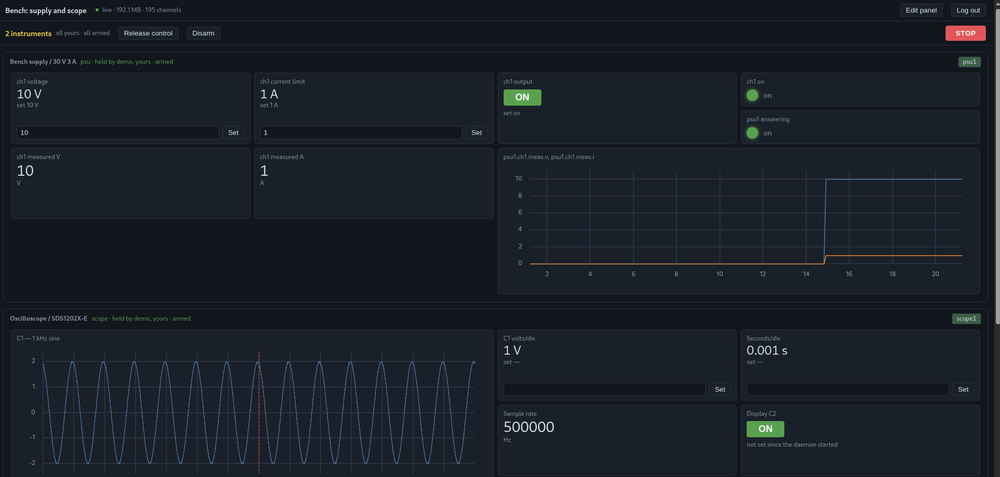

# Truke Ktest

Ktest turns a Linux machine and the test equipment connected to it into an
instrument rack you use from a browser. It covers three jobs that are usually
done by three unrelated tools:

- **Bus work.** CAN and CAN FD monitoring, decoding, transmit and replay over
  SocketCAN. LIN, ISO-TP and J1939 are planned.
- **Bench work.** Programmable supplies and oscilloscopes over SCPI. DMMs,
  loads and function generators are planned.
- **Recording.** Everything above goes onto one timeline, in one open format,
  [Logb](https://github.com/rveen/logb).

Having all three in one place is the reason the project exists. Bus tools do not
see the bench, and bench software does not see the bus, so today a supply
transient and the CAN traffic it caused have to be matched up by hand.

Ktest is meant as an open alternative to proprietary test environments such as
Vector CANoe. It is MIT licensed, and it keeps your test data in an open format.

<p>
  <a href="doc/ktest1.png"></a>
  <a href="doc/ktest2.png"></a>
</p>

## How it works

```
  browser (any OS)
      |  REST (control)     HTTP chunked response (Logb stream)
      v                                  ^
  +---------------------------------------------------+
  |  ktestd (Go, Linux)                               |
  |  bus layer      instrument layer   ->  .logb file |
  +---------------------------------------------------+
      |                    |
   CAN interfaces     bench instruments
```

- **The daemon owns the hardware.** It keeps connections open and leases
  sessions, and a run continues if the browser disconnects.
- **Everything produced is a Logb stream.** The file on disk and the bytes on
  the wire use the same format, so the live view and replay share one decoder.
- **Control goes one way.** Commands go in over REST, and results come back only
  on the stream. Nothing is actuated by default: a client must take a lease and
  arm the rack first, and every action is checked against limits that are
  written into the recording.
- **Timing is handled below the daemon.** The kernel runs cyclic transmit
  (CAN_BCM), not the daemon's event loop.

The full design is in [doc/test-software-outline.md](doc/test-software-outline.md).

## Commands

| Command | What it does |
| --- | --- |
| `cmd/ktestd` | The rack daemon. Records a bus, drives supplies and scopes, and serves the browser UI over HTTPS. |
| `cmd/canlogb` | A small CAN recorder: SocketCAN in, Logb out. It has no control plane, so it cannot actuate anything. |
| `cmd/logbcheck` | Checks a recording against independent references, such as candump logs and simulator transcripts. It also checks every control decision against the declared limits. |
| `cmd/psusim` | A simulated two-channel bench supply (Keysight SCPI dialect) with a resistive load on each channel. |
| `cmd/scopesim` | A simulated oscilloscope (Siglent SDS1000X-E SCPI dialect). |
| `cmd/vcanprobe` | Measures what a SocketCAN interface can actually do (timestamping, pacing, overflow). |

The Go packages are `can/` (SocketCAN), `record/` (frames to Logb), `stream/`
(fanning out a Logb stream to many consumers), `psu/` and `scope/`
(instrument drivers and simulators). The browser UI is in `web/`. It is written
in TypeScript, and its built output in `web/dist/` is committed and embedded in
`ktestd`.

## Getting started

The [user manual](https://trukeio.github.io/ktest/) ([source](doc/manual.html)) covers building and installing, setting up a
bench, the rack, scripting, limits and access in full. What follows is the
short version.

You need Linux and Go 1.25 or newer. The CAN and recording code uses AF_CAN
directly, so it only builds on Linux.

`go.mod` uses a `replace` directive that expects Logb to be checked out next to
this repository:

```sh
git clone https://github.com/rveen/logb ../logb
go build ./...
go test ./...
```

Without hardware, use a virtual CAN interface:

```sh
sudo modprobe vcan
sudo ip link add dev vcan0 type vcan
sudo ip link set up vcan0
```

Then run one of the demos. Each demo uses a simulated instrument, so no
hardware is needed:

- [examples/supply-bench](examples/supply-bench/README.md) drives a simulated
  bench supply at `https://localhost:8443/`.
- [examples/scope-bench](examples/scope-bench/README.md) drives a simulated
  oscilloscope at `https://localhost:8444/`.

```sh
examples/supply-bench/demo.sh
```

The demo prints a login token. Open the URL, accept the self-signed certificate
and paste the token.

For real hardware, [examples/orangepi-zero2-mcp2518fd](examples/orangepi-zero2-mcp2518fd/README.md)
describes a CAN FD interface on an Orange Pi Zero 2.

## Rebuilding the web UI

You only need to do this if you change `web/src/`:

```sh
cd web
npm install
npm run build
npm test
```

## Status

This is early, active work. Milestones 1 to 3 of the design outline are built.
Interfaces, file layouts and flags may still change.

## License

MIT, see [LICENSE](LICENSE).
